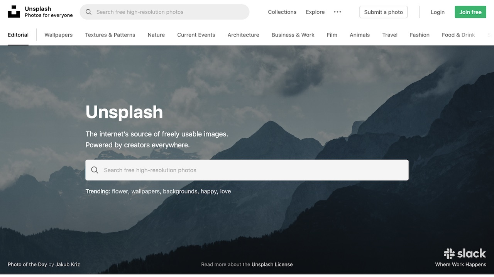
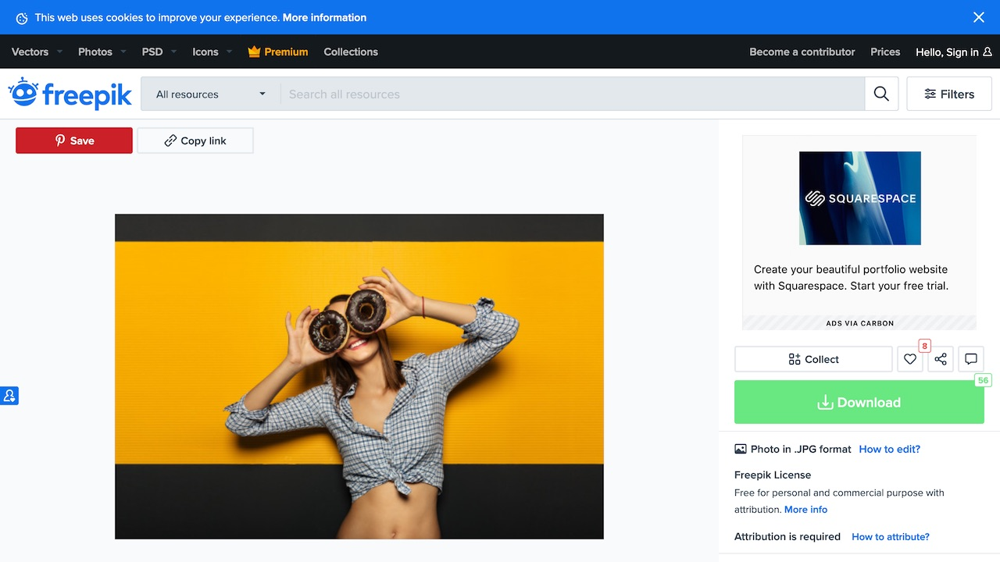

# Free Image Sites, Early 2020 edition

#### By **Tom Campbell**, January 11, 2019

{{ .Site.Company.Name }}
{{ .Site.Author.FullName }}
{{ .FrontMatter.Theme }}

You need some great clip art but have a budget of $0. You may even be working
for  a commercial organization. Where do you go? Here's a list
of websites that provide free images, even for commercial use---with
a few exceptions, discussed below.

How free are they? Usually the only thing they ask is a proper photo
credit and that you not use their images to go into competition with them.
Now that images licensed as public domain or CC0 don't even 
fall under those modest restrictions, and can be used for any purpose
at all.

## Are there any other catches?

One legal issue that many of these sites seem to ignore is that
at least in the USA you can't use someone's recognizable image
without their consent. The only legal certainty you have in this
case is if you  are in posession of a model release by that
person, a legal document outlining what rights you have to 
their image. 

Practically speaking many of the photographers have obtained such
model releases, but you can't know for sure unless you're in possession
of a signed copy.

## Free images for commercial use

[StockSnap.io](https://stocksnap.io/) is in serious growth mode and has
unusually generous licensing. Its images are in the public domain, which
means you can do anything you want with them, including resell on 
posters, T-shirts, coffee mugs, whatever.

#### StockSnap.io's public domain licensing is the best they get

[Pexels](https://www.pexels.com/) is a fan favorite, with some particularly 
high quality images and a good way of crediting its creators.

#### Pexels is an O.G. free image site and always provides great quality

[Taken Photos](https://taken.photos) acquires hundreds of photos a day, using machine
learning to label them. [Their license](https://creativecommons.org/publicdomain/zero/1.0/) 
is CC0, which means you can use the images with no restriction 
(but they aren't model released).

#### Taken is newer in the space and also has fantastic licensing terms

[Unsplash](https://unsplash.com) is another big player and they say their subjects have
signed model releases.

#### Unsplash gives you a bit more reassurance that their photographers have signed release forms

[freepik](https://www.freepik.com/) has a good search engine (before to choose Free),
and has a strong emphasis on vector images as well as photos. Not sure why the vector
images default to .EPS format, however.

#### Freepik doesn't seem to require model releases, so I chose a picture that makes the model unidentifiable

## Free cartoons for commercial use

* [Open Doodles](https://www.opendoodles.com) wins the coveted "funkiest free image site" award 
in this roundup with its very specific, literally cartoonish sensibility. It's also one of
the most flexible, because their [Generator](https://generator.opendoodles.com) lets you
design a color scheme for the images.

#### Custom designed using the Open Doodles Generator **by Tom Campbell**

* [Comicgen](https://gramener.com/comicgen/) from [Gramener](https://gramener.com/) is a 
close competitor to [Open Doodles](https://www.opendoodles.com)
in the funkiness sweepstakes.

#### Custom designed using Comicgen **by Tom Campbell**

## Beware of model releases

I was able to verify that one site requires model releases. That's [Freerange Stock](https://freerangestock.com) 
Now you know why there's only one picture in this article featuring a person with a recognizable face!

 

#### Thanks for going the extra mile, [Freerange Stock](https://freerangestock.com)! Photo by  **[Bruce Mars](https://freerangestock.com/photographer/Bruce-Mars/4224)**

## Adding credit

Each site has different requirements for photo credits, some of them
surprisingly relaxed. Whenever possible I like to link right to the
image itself and whenever possibler the photographer's page on the free image site.

## There's always catch, but this one isn't too bad

When *can't* you use these images? 

**Collections** Most, though not all, only have problem with your using the image
in the case where you are competiting with the sites themselves. 
In other words, don't stockpile copies of all their images and try to start a competiting site.
The license terms on the images normally forbid such use.

**Reselling** You probably aren't allowed to use these images on things you resell in bulk,
for example, T-shirts or coffee mugs. Check the license terms on each site to be sure.
For example, anything using [CC0](https://creativecommons.org/publicdomain/zero/1.0/) 
licensing is without any restriction.

## Your Free Image Usage Checklist

* If there's a recognizable face, was a model release done?
* If credit is required, did you include it? Remember that a direct link may be needed
* Is the image actually available for commercial usage? At time of writing all the sites here
allow it, unless you are bundling huge sets of these images to build a competing site.
